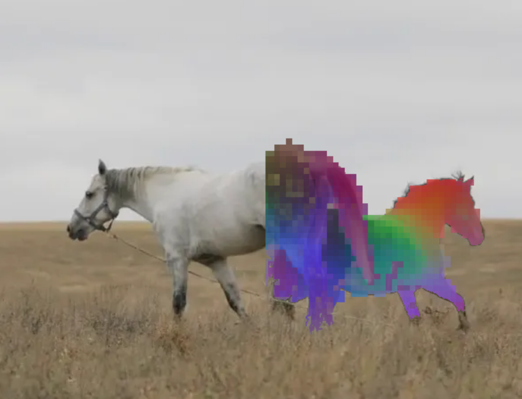
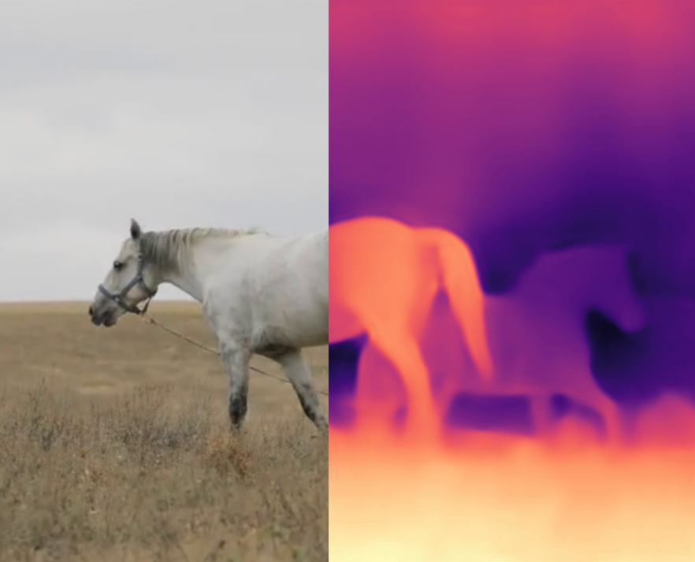
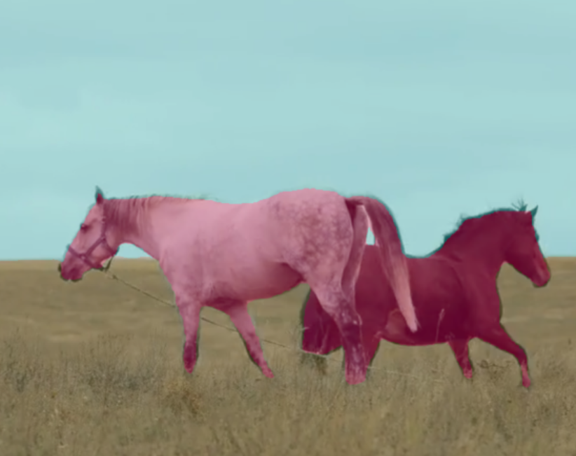

# 🦕 DINOv2 Feature Visualization Demo

## 📖 简介

本项目展示了DINOv2模型的特征可视化效果，帮助学生理解自监督学习模型是如何"看到"图像的。

## 🚀 快速开始

1. 点击上方的"Open in Colab"按钮
2. 运行所有代码单元格
3. 查看DINOv2特征可视化结果

## 官方Demo
👉 [体验 DINOv2 在线 Demo](https://dinov2.metademolab.com/)

### Depth Estimation

